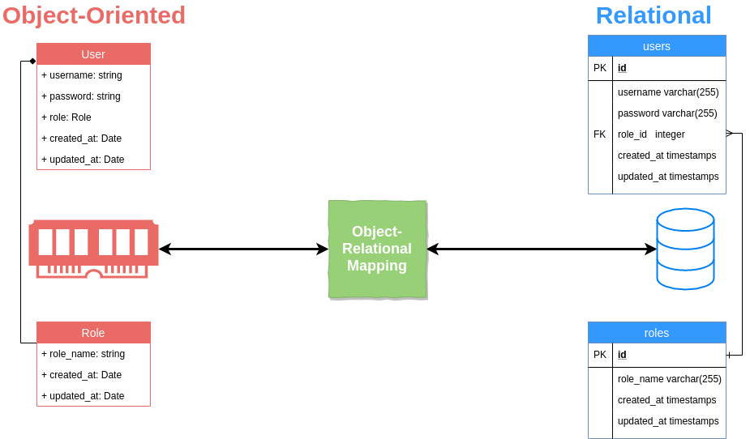

## 二、ORM 是什麼? ORM 介紹
### ORM是甚麼呢？ORM全名是Object-Relational Mapping，中文是物件關係對映。顧名思義，就是將關聯式資料庫(Relational Database Management System)的資料，映射到物件(Object)之中，反之亦然。
### 關聯式資料庫(Relational Database)與物件導向的編程，先天就有不少不契合的地方，電腦科學有一個專有名詞去形容關聯式資料庫與物件導向設計之間之不協調，也就是Object-relational impedance mismatch。為數不少的物件導向概念例如接口、繼承等，在資料庫的世界，完全沒有相對應的概念。 ORM的存在意義，就是為了撫平兩者中間的不協調，將資料庫中的資料，映射到記憶體的物件之中，而無需軟件工程師再煩惱。
### 
### ORM的優缺點：
### 優點：
#### 1）提高開發效率，降低開發成本
#### 2）使開發更加物件化
#### 3）可移植
#### 4）可以很方便地引入資料快取之類的附加功能
### 缺點：
#### 1）自動化進行關係資料庫的對映需要消耗系統性能。其實這裡的效能消耗還好啦，一般來說都可以忽略之。
#### 2）在處理多表聯查、where條件複雜之類的查詢時，ORM的語法會變得複雜。
### 常用ORM框架：
#### （1）Hibernate : 全自動,需要寫hql語句
#### （2）iBATIS : 半自動,自己寫sql語句,可操作性強,小巧