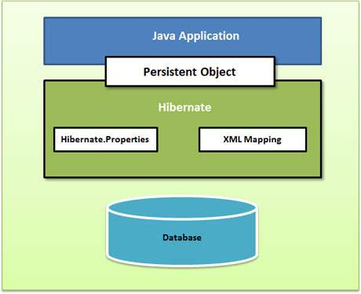

## 三、Hibernate 架構
### Hibernate架構是分層的，隔離的不必知道底層API。 Hibernate中使用數據庫和配置信息來為應用程序提供持久化服務（以及持久的類）。
### 
### 
### Hibernate使用各種現有的Java API，如JDBC，Java事務API（JTA）和Java命名和目錄接口（JNDI）。
### JDBC提供了常見的關係數據庫功能的抽象的一個基本功能，使其具有JDBC驅動程序，Hibernate支持幾乎任何數據庫。
### Hibernate的核心元件簡介：
### 1. Configuration 類
#### 是在任何Hibernate應用程序中創建並通常在應用程序初始化創建一次，第一個Hibernate的類。它代表了Hibernate所需的配置或屬性文件。 
#### Configuration 類提供了兩個按鍵組成部分：
#### 1) 數據庫連接：這是通過Hibernate支持的一個或多個配置文件來處理。這些文件是：
#### hibernate.properties和hibernate.cfg.xml。
#### 2) 類映射設置：此類創建Java類和數據庫表之間的連接。
### 2. SessionFactory介面:
#### SessionFactroy介面負責初始化Hibernate。它充當資料儲存源的代理,並負責建立Session物件。這裡用到了工廠模式。
#### 一個SessionFactory對應一個數據源，它是個重量級物件，不可隨意生成多個例項。對於一般的單資料庫應用來說，只需要一個SessionFactory就足夠了。
#### 當然如果有多個數據庫的話，還是需要為每個資料庫生成對應的SessionFactory。它是執行緒安全的，同一個例項可以被應用中的多個執行緒共享。
### 3. Session介面:
#### Session介面負責執行被持久化物件的操作,它有get( ),load( ),save( ),update( )和delete( )等方法用來對 PO 進行載入、儲存、更新及刪除等操作。
#### 但需要注意的是Session物件是非執行緒安全的。同時,Hibernate的session不同於JSP應用中的HttpSession。這裡當使用session這個術語時,其實指的是Hibernate中的session。
#### 非執行緒安全是指多執行緒操作同一個物件可能會出現問題。 而執行緒安全則是多執行緒操作同一個物件不會有問題。 執行緒安全必須要使用很多synchronized關鍵字來同步控制，所以必然會導致效能的降低。 
### 4. Transaction介面:
#### Transaction介面負責事務相關的操作,用來管理Hibernate事務,它的主要方法有commit()和rollback(),可以使用Session的beginTransaction()方法生成。它是可選的,開發人員也可以設計編寫自己的底層事務處理程式碼。
### 5. Query介面:
#### Query介面負責執行各種資料庫查詢。它可以使用HQL語言,用來對PO進行查詢操作。它可以使用Session的createQuery()方法生成。
### 6. Criteria介面： 
#### 完全封裝了基於字串形式的查詢語句，比Query更面向物件，Criteria更擅長執行動態查詢。
