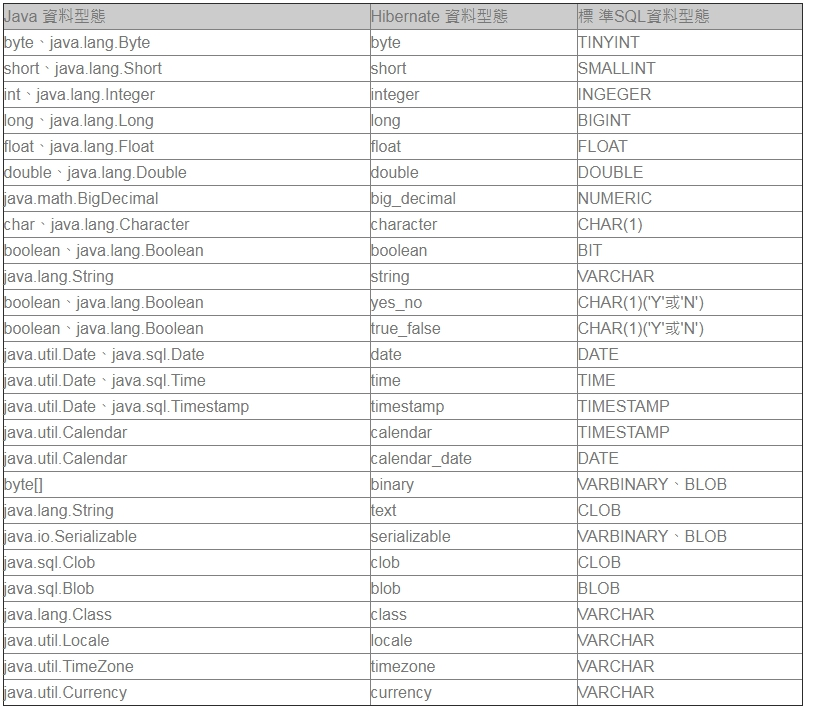

## 八、Hibenate 映射文件
### Hibernate 中將物件與資料庫表格映射關係連接起來的是映射文件，如果使用XML來定義，通常以*.hbm.xml作為檔案名稱。
### XML映射文件可以手工撰寫，或是透過工具程式從資料庫表格自動生成。
### 來看看一個基本的映射文件如何撰寫：
#### User.hbm.xml:
	<?xml version="1.0" encoding="utf-8"?> 
	<!DOCTYPE hibernate-mapping 
	 PUBLIC "-//Hibernate/Hibernate Mapping DTD 3.0//EN" 
	 "http://hibernate.sourceforge.net/hibernate-mapping-3.0.dtd"> 

	<hibernate-mapping> 
		<!--類別名稱與表格名稱映射-->
		<class name="demo.model.User" table="user"> 
			<!--id與主鍵映射-->
			<id name="id" column="id"> 
				<generator class="native"/> 
			</id> 
			<!--類別屬性與表格欄位的映射-->
			<property name="name" column="name"/> 
			<property name="age" column="age"/> 
		</class> 
	</hibernate-mapping>
### 映射文件中主要包括三個部份：
	1. 類別名稱與表格名稱的映射、
	2. id屬性與主鍵的映射、
	3. 類別屬性與表格欄位的映射。
### 這份映射文件對應於以下的類別與表格：
#### User.java:
	public class User {
		private Integer id;
		private String name;
		private Integer age;
	 
		// 必須要有一個預設的建構方法
		// 以使得Hibernate可以使用Constructor.newInstance()建立物件
		public User() {}

		public Integer getId() {
			return id;
		}

		public void setId(Integer id) {
			this.id = id;
		}

		public String getName() {
			return name;
		}

		public void setName(String name) {
			this.name = name;
		}
	 
		public Integer getAge() {
			return age;
		}

		public void setAge(Integer age) {
			this.age = age;
		}
	}
#### Table : User

	在 tag:id或 tag:property 的設定上，name設定類別上的屬性名，而column對應至表格欄位，如果屬性名稱與欄位名稱相同，則可以省略column屬性設定。
	<id>或<property>上，可以設定type屬性，在type上可以設定Java類別的資料 型態，但由於 Java的資料型態與資料庫的資料型態並不是一對一對應的，
	為此Hibernate提供它自己的資料型態，作為Java資料型態與資料庫資料型態的連接型 態，下面的表格列出型態之間的對應：

#### 一個設定的方式如下所示：
	<property name="name" column="name" type="string"/>
	tag:generator 設定主鍵的生成方式，可以設定"native" 
	表示由Hibernate自動根據Dialect選擇 採用 identity、hilo、sequence等作為主鍵生成方式，
	也可以考慮採用uuid由Hibernate根據128位元UUID演算法（128- bit UUID algorithm）生成16進位制數值，
	並編碼為32位長度的字串。
#### 我們可以在tag:hibernate-mapping上設定package屬性，
#### 如此一來，文件中要設置類別名稱時，就不用寫出完整的package，例如：
	<hibernate-mapping package="demo.model">
		<!--類別名稱與表格名稱映射-->
		<class name="User" table="user">
			....
		</class>
	</hibernate-mapping>
#### 在使用HQL時，您可以只使用類別名稱來替代完整名稱：
	// 相當於寫"from demo.model.User"
	Query query = session.createQuery("from User"); 

#### 這是Hibernate的auto-import功能，然而如果在不同的package下都有User類別，則Hibernate將無從得知是要使用哪個User類別，
#### 可以在tag:hibernate-mapping上設定auto-import屬性為false，關閉auto-import功能，並在HQL中撰寫完整的類別名稱。

#### 另一種解決的方式，是在<hibernate-mapping>中使用<import>設定別名，例如：
	<hibernate-mapping>
		<import class="demo.model.User" rename="DemoUser"/>
	</hibernate-mapping>

#### 之後在指定HQL中，即可使用這個別名：
	Query query = session.createQuery("from DemoUser"); 
#### 對於一些不能為空的屬性，可以在<property>上加上not-null屬性為true，如此Hibernate可以直接檢查屬性是否為null，而不用等進入到資料庫中再作檢查。
#### 如果有某個屬性，其值取決於表格欄位自己產生的值，而非程式中主動設定的值，例如資料新增時，會由資料庫產生新增時的時間，而這個值想要主動提取至物件的對應屬性，則可以在<property>上設定generated屬性，例如：
	...
		<property name="time" column="time"
				  insert="false" update="false" generated="always"/>
	...
#### 如上設定之後，當物件儲存時，time屬性並不會參與儲存，而是由資料庫產生time欄位值，再SELECT出來設定給time屬性，由於並非實際要儲存屬性，所以設定insert為false，而由於這個欄位由資料庫維護，所以update設定為false。
#### 如果物件上有個屬性，實際上並沒有欄位與之對應，您只是想藉由資料庫中的欄位查詢來取得，例如使用COUNT函式來取得所有的筆數，則您可以使用formula屬性，例如：
	...
		<property name="average" formula="(SELECT AVG(u.age) FROM T_USER u)"/>
	...
