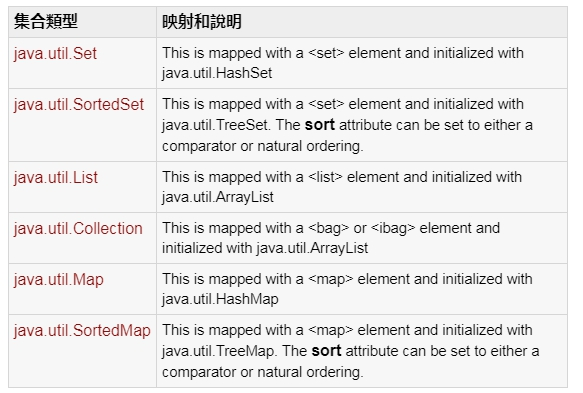
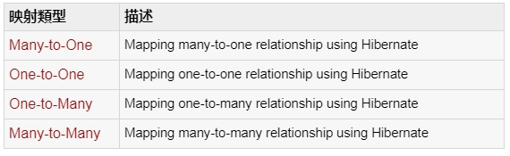
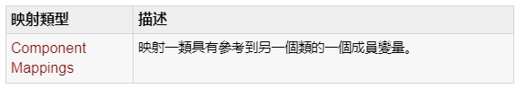

## 十一、Hibenate O/R 映射
### 1. 集合映射（Collection mappings）
#### 如果一個實例或者類中有特定變量的值的集合，那麽我們可以應用 Java 中的任何的可用的接口來映射這些值
### 
#### [java.util.Set](https://www.tutorialspoint.com/hibernate/hibernate_set_mapping.htm "參考範例")
#### [java.util.SortedSet](https://www.tutorialspoint.com/hibernate/hibernate_sortedset_mapping.htm "參考範例")
#### [java.util.List](https://www.tutorialspoint.com/hibernate/hibernate_list_mapping.htm "參考範例")
#### [java.util.Collection](https://www.tutorialspoint.com/hibernate/hibernate_bag_mapping.htm "參考範例")
#### [java.util.Map](https://www.tutorialspoint.com/hibernate/hibernate_map_mapping.htm)
#### [java.util.SortedMap](https://www.tutorialspoint.com/hibernate/hibernate_sortedmap_mapping.htm "參考範例")

### 2. 關聯映射
#### 實體類之間的關聯映射以及表之間的關系是 ORM 的靈魂之處。對象間的關系的子集可以用下列四種方式解釋。關聯映射可以是單向的也可以是雙向的。
### 
#### [Many-to-One](https://www.tutorialspoint.com/hibernate/hibernate_many_to_one_mapping.htm "參考範例")
#### [One-to-One](https://www.tutorialspoint.com/hibernate/hibernate_one_to_one_mapping.htm "參考範例")
#### [One-to-Many](https://www.tutorialspoint.com/hibernate/hibernate_one_to_many_mapping.htm "參考範例")
#### [Many-to-Many](https://www.tutorialspoint.com/hibernate/hibernate_many_to_many_mapping.htm "參考範例")

### 3. 組件映射
#### 作為變量的一員實體類很可能和其它類具有相關關系。如果引用的類沒有自己的生命周期並且完全依靠於擁有它的那個實體類的生命周期的話，那麽這個引用類因此就可以叫做組件類。
### 
#### [Component Mappings](https://www.tutorialspoint.com/hibernate/hibernate_component_mappings.htm "參考範例")

### 範例:
#### table schema
	create table EMPLOYEE (
	   id INT NOT NULL auto_increment,
	   first_name VARCHAR(20) default NULL,
	   last_name  VARCHAR(20) default NULL,
	   salary     INT  default NULL,
	   address    INT NOT NULL,
	   PRIMARY KEY (id)
	);

	create table ADDRESS (
	   id INT NOT NULL auto_increment,
	   street_name VARCHAR(40) default NULL,
	   city_name VARCHAR(40) default NULL,
	   state_name VARCHAR(40) default NULL,
	   zipcode VARCHAR(10) default NULL,
	   PRIMARY KEY (id)
	);
	
#### POJO Classes
	
	public class Employee{
	   private int id;
	   private String firstName; 
	   private String lastName;   
	   private int salary;
	   private Address address;

	   public Employee() {}
	   
	   public Employee(String fname, String lname, int salary, Address address ) {
		  this.firstName = fname;
		  this.lastName = lname;
		  this.salary = salary;
		  this.address = address;
	   }
	   
	   public int getId() {
		  return id;
	   }
	   
	   public void setId( int id ) {
		  this.id = id;
	   }
	   
	   public String getFirstName() {
		  return firstName;
	   }
	   
	   public void setFirstName( String first_name ) {
		  this.firstName = first_name;
	   }
	   
	   public String getLastName() {
		  return lastName;
	   }
	   
	   public void setLastName( String last_name ) {
		  this.lastName = last_name;
	   }
	   
	   public int getSalary() {
		  return salary;
	   }
	   
	   public void setSalary( int salary ) {
		  this.salary = salary;
	   }

	   public Address getAddress() {
		  return address;
	   }
	   
	   public void setAddress( Address address ) {
		  this.address = address;
	   }
	}
	
	public class Address{
	   private int id;
	   private String street;     
	   private String city;     
	   private String state;    
	   private String zipcode; 

	   public Address() {}
	   
	   public Address(String street, String city, String state, String zipcode) {
		  this.street = street; 
		  this.city = city; 
		  this.state = state; 
		  this.zipcode = zipcode; 
	   }
	   
	   public int getId() {
		  return id;
	   }
	   
	   public void setId( int id ) {
		  this.id = id;
	   }
	   
	   public String getStreet() {
		  return street;
	   }
	   
	   public void setStreet( String street ) {
		  this.street = street;
	   }
	   
	   public String getCity() {
		  return city;
	   }
	   
	   public void setCity( String city ) {
		  this.city = city;
	   }
	   
	   public String getState() {
		  return state;
	   }
	   
	   public void setState( String state ) {
		  this.state = state;
	   }
	   
	   public String getZipcode() {
		  return zipcode;
	   }
	   
	   public void setZipcode( String zipcode ) {
		  this.zipcode = zipcode;
	   }
	   
	}
	
#### Employee.hbm.xml
	<?xml version = "1.0" encoding = "utf-8"?>
	<!DOCTYPE hibernate-mapping PUBLIC 
	"-//Hibernate/Hibernate Mapping DTD//EN"
	"http://www.hibernate.org/dtd/hibernate-mapping-3.0.dtd"> 

	<hibernate-mapping>
	   <class name = "Employee" table = "EMPLOYEE">
		  
		  <meta attribute = "class-description">
			 This class contains the employee detail. 
		  </meta>
		  
		  <id name = "id" type = "int" column = "id">
			 <generator class="native"/>
		  </id>
		  
		  <property name = "firstName" column = "first_name" type = "string"/>
		  <property name = "lastName" column = "last_name" type = "string"/>
		  <property name = "salary" column = "salary" type = "int"/>
		  <many-to-one name = "address" column = "address" 
			 class="Address" not-null="true"/>
			 
	   </class>

	   <class name = "Address" table="ADDRESS">
		  
		  <meta attribute = "class-description">
			 This class contains the address detail. 
		  </meta>
		  
		  <id name = "id" type = "int" column = "id">
			 <generator class="native"/>
		  </id>
		  
		  <property name = "street" column = "street_name" type = "string"/>
		  <property name = "city" column = "city_name" type = "string"/>
		  <property name = "state" column = "state_name" type = "string"/>
		  <property name = "zipcode" column = "zipcode" type = "string"/>
		  
	   </class>

	</hibernate-mapping>
	
