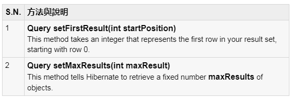

## 十三、Hibenate 查詢語言
#### Hibernate查詢語言（HQL）是一種麵向對象的查詢語言，類似於SQL，但不是對表和列操作，HQL適用於持久對象和它們的屬性。 HQL查詢由Hibernate轉換成傳統的SQL查詢，在數據庫執行操作。

#### 雖然可以直接使用SQL語句和Hibernate使用原生SQL，但建議使用HQL儘可能避免數據庫可移植性的麻煩，並采取Hibernate的SQL生成和緩存策略的優勢。

### FROM 語句
#### 使用FROM子句，加載一個完整的持久化對象到內存中。下麵是一個使用FROM子句的簡單的語法：

	String hql = "FROM Employee";
	Query query = session.createQuery(hql);
	List results = query.list();

#### 如果需要完全限定在HQL一個類名，隻需指定如下的包和類名：

	String hql = "FROM com.hibernatebook.criteria.Employee";
	Query query = session.createQuery(hql);
	List results = query.list();

### AS 語句
#### AS子句可以用來別名分配給類中的HQL查詢，特別是當有很長的查詢時。

	String hql = "FROM Employee AS E";
	Query query = session.createQuery(hql);
	List results = query.list();
	
#### AS關鍵字是可選的，也可以直接在之後的類名指定別名，如下所示：

	String hql = "FROM Employee E";
	Query query = session.createQuery(hql);
	List results = query.list();

### SELECT 子句
#### SELECT子句提供了更多的控製權比from子句的結果集。如果想獲得對象而不是整個對象的幾個屬性，使用SELECT子句。
#### 下麵是一個使用SELECT語句來獲取Employee對象中FIRST_NAME 的簡單的語法：

	String hql = "SELECT E.firstName FROM Employee E";
	Query query = session.createQuery(hql);
	List results = query.list();
	
#### 值得注意的是在這裡，Employee.firstName是Employee對象的一個屬性，而不是EMPLOYEE表的一個字段。

### WHERE 子句
#### 如果想縮小了從存儲返回的特定對象，可以使用WHERE子句。下麵是一個使用WHERE子句的簡單的語法：

	String hql = "FROM Employee E WHERE E.id = 10";
	Query query = session.createQuery(hql);
	List results = query.list();

### ORDER BY 子句
#### 若要排序HQL查詢的結果，將需要使用ORDER BY子句。您可以在結果集按升序（ASC）或降序（DESC）通過在對象的任何屬性排序結果。下麵是一個使用ORDER BY子句的簡單的語法：

	String hql = "FROM Employee E WHERE E.id > 10 ORDER BY E.salary DESC";
	Query query = session.createQuery(hql);
	List results = query.list();
#### 如果想通過一個以上的屬性進行排序，你會僅僅是額外的屬性添加到由子句用逗號隔開，如下所示的命令的結尾：

	String hql = "FROM Employee E WHERE E.id > 10 " +
				 "ORDER BY E.firstName DESC, E.salary DESC ";
	Query query = session.createQuery(hql);
	List results = query.list();

### GROUP BY 子句
#### 該子句允許從Hibernate的它基於屬性的值的數據庫和組提取信息，並且通常使用結果包括總值。下麵是一個使用GROUP BY子句的語法很簡單：

	String hql = "SELECT SUM(E.salary), E.firtName FROM Employee E " +
				 "GROUP BY E.firstName";
	Query query = session.createQuery(hql);
	List results = query.list();

### 使用命名參數
#### Hibernate命名支持在其HQL查詢參數。這使得編寫接受來自用戶的輸入容易。下麵是一個使用命名參數的簡單的語法：

	String hql = "FROM Employee E WHERE E.id = :employee_id";
	Query query = session.createQuery(hql);
	query.setParameter("employee_id",10);
	List results = query.list();

### UPDATE 子句
#### 在UPDATE子句可以用於更新一個或多個對象中的一個或多個屬性。下麵是一個使用UPDATE子句的簡單的語法：

	String hql = "UPDATE Employee set salary = :salary "  + 
				 "WHERE id = :employee_id";
	Query query = session.createQuery(hql);
	query.setParameter("salary", 1000);
	query.setParameter("employee_id", 10);
	int result = query.executeUpdate();
	System.out.println("Rows affected: " + result);

### DELETE 子句
#### DELETE子句可以用來刪除一個或多個對象。下麵是一個使用DELETE子句的簡單的語法：

	String hql = "DELETE FROM Employee "  + 
				 "WHERE id = :employee_id";
	Query query = session.createQuery(hql);
	query.setParameter("employee_id", 10);
	int result = query.executeUpdate();
	System.out.println("Rows affected: " + result);

### INSERT 子句
#### HQL支持INSERT INTO子句中隻記錄在那裡可以插入從一個對象到另一個對象。以下是使用INSERT INTO子句的簡單的語法：

	String hql = "INSERT INTO Employee(firstName, lastName, salary)"  + 
				 "SELECT firstName, lastName, salary FROM old_employee";
	Query query = session.createQuery(hql);
	int result = query.executeUpdate();
	System.out.println("Rows affected: " + result);

### 聚合方法
#### HQL支持多種聚合方法，類似於SQL。他們工作在HQL同樣的方式在SQL和下麵的可用功能列表：

#### DISTINCT關鍵字隻計算在該行設定的唯一值。下麵的查詢將隻返回唯一的計數：

	String hql = "SELECT count(distinct E.firstName) FROM Employee E";
	Query query = session.createQuery(hql);
	List results = query.list();

### 使用查詢分頁
#### 有用於分頁查詢接口的兩個方法。

#### This method tells Hibernate to retrieve a fixed number maxResults of objects.
#### 采用上述兩種方法一起，可以在網站或Swing應用程序構建一個分頁組件。下麵是例子，可以擴展來獲取10行：

	String hql = "FROM Employee";
	Query query = session.createQuery(hql);
	query.setFirstResult(1);
	query.setMaxResults(10);
	List results = query.list();
