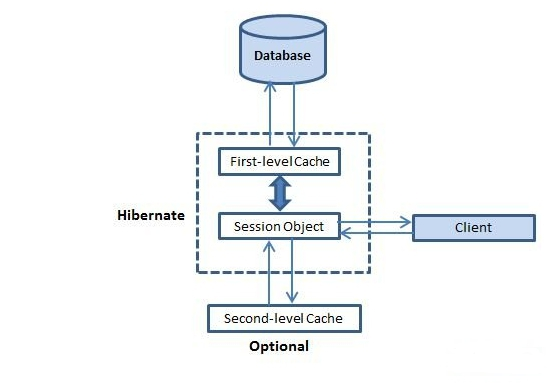

## 十六、Hibernate 緩存
#### 緩存是位於應用程序和數據庫之間所有關於應用程序的性能優化，以避免數據庫訪問多次，讓性能關鍵型應用程序有更好的表現。
#### 緩存對Hibernate很重要，它采用了多級緩存方案下文所述：

### 第一級緩存：
#### 是Session級別的緩存，一個Session做了一個查詢操作，它會把這個操作的結果放在一級緩存中，
#### 如果短時間內這個session（一定要同一個session）又做了同一個操作，那麽hibernate直接從一級緩存中拿，而不會再去連數據庫中取數據；
#### 它可以在session範圍內減少數據庫的訪問次數！只在session範圍有效！ Session關閉，一級緩存失效！
#### 只要是持久化對象狀態的，都受Session管理，也就是說，都會在Session緩存中！
#### Session的緩存由hibernate維護，用戶不能操作緩存內容； 如果想操作緩存內容，必須通過hibernate提供的evit/clear方法操作。
#### 和緩存有關常用的方法有三個：
	session.flush(); 讓一級緩存與數據庫同步
	session.evict(arg0); 清空一級緩存中指定的對象
	session.clear(); 清空一級緩存中緩存的所有對象

### 二級緩存：
#### 是SessionFactory級別的緩存，顧名思義，就是查詢的時候會把查詢結果緩存到二級緩存中，
#### 如果同一個sessionFactory創建的某個session執行了相同的操作，hibernate就會從二級緩存中拿結果，而不會再去連接數據庫；
#### 二級緩存是基於應用程序的緩存，可以讓不同的 session 訪問。

### 配置Hibernate二級緩存的主要步驟：

#### 1) 選擇需要使用二級緩存的持久化類，設置它的命名緩存的並發訪問策略。這是最值得認真考慮的步驟。

#### 2) 選擇合適的緩存插件，然後編輯該插件的配置文件。

	<property name="hbm2ddl.auto">update</property>
	<!-- 啟動二級緩存 -->
	<property name="cache.use_second_level_cache">true</property>
	<!-- 指定使用哪種二級緩存 -->
	<property name="cache.provider_class">org.hibernate.cache.OSCacheProvider</property>
	<mapping resource="com/hsp/domain/Department.hbm.xml" />
	<mapping resource="com/hsp/domain/Student.hbm.xml" />
	<!-- 指定哪個domain啟用二級緩存 
	特別說明二級緩存策略:
	1. read-only
	2. read-write
	3. nonstrict-read-write
	4. transcational
	-->
	<class-cache class="com.hsp.domain.Student" usage="read-write"/>

### 並發策略：
#### 並發策略是一個負責存儲數據項在緩存的中介並從緩存中檢索它們。
#### 如果要啟用二級緩存，將必須決定，為每個持久化類和集合，要使用的緩存並發策略。

	Transactional: 使用這種策略的主要讀取數據的地方，以防止過時的數據的並發事務，在更新的罕見情況下是至關重要的。

	Read-write: 再次使用這種策略的主要讀取數據的地方，以防止並發事務陳舊的數據是至關重要的，在更新的罕見情況。

	Nonstrict-read-write: 這種策略不保證緩存與數據庫之間的一致性。使用此策略，如果數據很少改變和陳舊數據的可能性很小關鍵是不關注。

	Read-only: 並發策略適用於數據，永遠不會改變。使用數據僅供參考。

