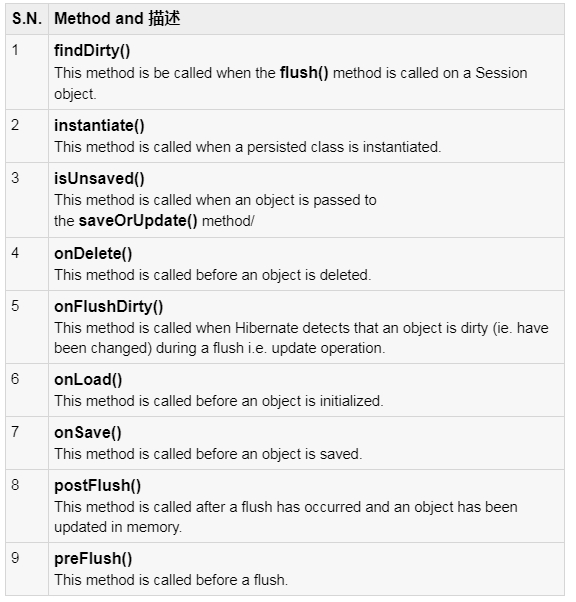

## 十八、Hibernate攔截器
#### 如前面所學，在Hibernate中，將創建並保留一個物件(Persistance Object)。更改物件後，必須將其保存回數據庫。該過程將一直持續到下一次需要該對象時為止，並將從持久性存儲中加載該對象。
#### 因此，一個物件在其生命週期中經歷了不同的階段，並且攔截器界面提供了可以在不同的階段調用以執行某些所需任務的方法。
#### 這些方法是從session到應用程序的回調(call back)，從而允許應用程序在保存，更新，刪除或加載持久對象之前檢查(和/或)操縱該物件的屬性。
#### 以下是攔截器界面中所有可用方法的列表：

#### findDirty():在Session對像上調用flush（）方法時將調用此方法。
#### instantiate():當實例化持久化類時，將調用此方法。
#### isUnsaved():將物件傳遞給saveOrUpdate（）方法時，將調用此方法
#### onDelete():在刪除物件之前調用此方法。
#### onFlushDirty():當Hibernate在刷新（即更新）操作期間檢測到物件髒了（即已更改）時，將調用此方法。
#### onLoad():在初始化物件之前調用此方法。
#### onSave():在保存物件之前調用此方法。
#### postFlush():發生刷新並且內存中的物件已更新後，將調用此方法。
#### preFlush():在刷新之前調用此方法。

### Hibernate的攔截器有兩種設定方式，
#### 一種是使用sessionFactory.openSession(Interceptor interceptor)，這樣的攔截器只會針對該session有效，又叫做區域性攔截器。
#### 另一種是使用Configuration的setInterceptor(Interceptor interceptor)方法設定，這樣的攔截器對每一個session都有效，又稱之為全域性攔截器

#### Hibernate Interceptor 使我們可以完全控制物件在應用程序和數據庫中的表現。
### 如何使用攔截器？
#### 要構建攔截器，可以直接實作Interceptor類，也可以繼承 EmptyInterceptor 類。以下是使用Hibernate 攔截器功能的簡單步驟。
### 創建攔截器：
#### 我們將在範例中繼承 EmptyInterceptor，其中在創建和更新 Employee 對象時將自動調用Interceptor的方法。你可以根據需要實作更多方法。
	import java.io.Serializable;
	import java.util.Date;
	import java.util.Iterator;

	import org.hibernate.EmptyInterceptor;
	import org.hibernate.Transaction;
	import org.hibernate.type.Type;

	public class MyInterceptor extends EmptyInterceptor {
	   private int updates;
	   private int creates;
	   private int loads;

	   public void onDelete(Object entity, Serializable id,
		  Object[] state, String[] propertyNames, Type[] types) {
		   // do nothing
	   }

	   // This method is called when Employee object gets updated.
	   public boolean onFlushDirty(Object entity, Serializable id,
		  Object[] currentState, Object[] previousState, String[] propertyNames,
		  Type[] types) {
			 if ( entity instanceof Employee ) {
				System.out.println("Update Operation");
				return true; 
			 }
			 return false;
	   }
		
	   public boolean onLoad(Object entity, Serializable id,
		  Object[] state, String[] propertyNames, Type[] types) {
			 // do nothing
			 return true;
	   }
	   
	   // This method is called when Employee object gets created.
	   public boolean onSave(Object entity, Serializable id,
		  Object[] state, String[] propertyNames, Type[] types) {
			 if ( entity instanceof Employee ) {
				System.out.println("Create Operation");
				return true; 
			 }
			 return false;
	   }
	   
	   //called before commit into database
	   public void preFlush(Iterator iterator) {
		  System.out.println("preFlush");
	   }
	   
	   //called after committed into database
	   public void postFlush(Iterator iterator) {
		  System.out.println("postFlush");
	   }
	}

### 創建POJO類： Employee.java
### 創建數據庫表：Employee table schema
### 創建映射配置文件： Employee.hbm.xml
### 創建應用程序類： EmployDao.java
	/* Method to CREATE an employee in the database */
	public Integer addEmployee(String fname, String lname, int salary){
	  Session session = factory.openSession( new MyInterceptor() );
	  Transaction tx = null;
	  Integer employeeID = null;
	  try{
		 tx = session.beginTransaction();
		 Employee employee = new Employee(fname, lname, salary);
		 employeeID = (Integer) session.save(employee); 
		 tx.commit();
	  }catch (HibernateException e) {
		 if (tx!=null) tx.rollback();
		 e.printStackTrace(); 
	  }finally {
		 session.close(); 
	  }
	  return employeeID;
	}
	/* Method to  READ all the employees */
	public void listEmployees( ){
	  Session session = factory.openSession( new MyInterceptor() );
	  Transaction tx = null;
	  try{
		 tx = session.beginTransaction();
		 List employees = session.createQuery("FROM Employee").list(); 
		 for (Iterator iterator = 
						   employees.iterator(); iterator.hasNext();){
			Employee employee = (Employee) iterator.next(); 
			System.out.print("First Name: " + employee.getFirstName()); 
			System.out.print("  Last Name: " + employee.getLastName()); 
			System.out.println("  Salary: " + employee.getSalary()); 
		 }
		 tx.commit();
	  }catch (HibernateException e) {
		 if (tx!=null) tx.rollback();
		 e.printStackTrace(); 
	  }finally {
		 session.close(); 
	  }
	}
	/* Method to UPDATE salary for an employee */
	public void updateEmployee(Integer EmployeeID, int salary ){
	  Session session = factory.openSession( new MyInterceptor() );
	  Transaction tx = null;
	  try{
		 tx = session.beginTransaction();
		 Employee employee = 
					(Employee)session.get(Employee.class, EmployeeID); 
		 employee.setSalary( salary );
		 session.update(employee); 
		 tx.commit();
	  }catch (HibernateException e) {
		 if (tx!=null) tx.rollback();
		 e.printStackTrace(); 
	  }finally {
		 session.close(); 
	  }
	}
	/* Method to DELETE an employee from the records */
	public void deleteEmployee(Integer EmployeeID){
	  Session session = factory.openSession( new MyInterceptor() );
	  Transaction tx = null;
	  try{
		 tx = session.beginTransaction();
		 Employee employee = 
				   (Employee)session.get(Employee.class, EmployeeID); 
		 session.delete(employee); 
		 tx.commit();
	  }catch (HibernateException e) {
		 if (tx!=null) tx.rollback();
		 e.printStackTrace(); 
	  }finally {
		 session.close(); 
	  }
	}

###  編譯和執行：
#### 會得到以下結果，並且將在EMPLOYEE表中創建記錄。
	Create Operation
	preFlush
	postFlush
	Create Operation
	preFlush
	postFlush
	Create Operation
	preFlush
	postFlush
	First Name: Zara  Last Name: Ali  Salary: 1000
	First Name: Daisy  Last Name: Das  Salary: 5000
	First Name: John  Last Name: Paul  Salary: 10000
	preFlush
	postFlush
	preFlush
	Update Operation
	postFlush
	preFlush
	postFlush
	First Name: Zara  Last Name: Ali  Salary: 5000
	First Name: John  Last Name: Paul  Salary: 10000
	preFlush
	postFlush

